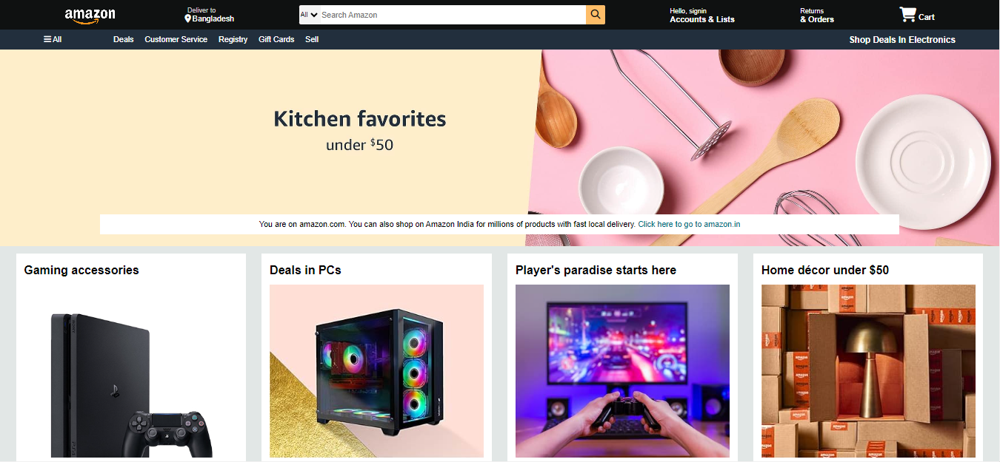

# Amazon-Clone
This project is a front-end clone of the Amazon website, built using HTML and CSS. The clone aims to replicate the design and layout of the Amazon homepage, showcasing various product categories, a navigation bar, and a footer section. It serves as a practice project to enhance my skills in web design and development, focusing on creating a responsive and visually appealing layout.

## Features
*Responsive design that adjusts to various screen sizes
*Navigation bar with dropdown menus
*Product categories with images and links
*Footer section with multiple columns of links
*Use of CSS Flexbox for layout management
*Custom styling to closely match Amazon's design

##Technologies Used
*HTML: For structuring the content on the web pages
*CSS: For styling and layout

## Screenshot

## Future Enhancements
*Add JavaScript for interactive features like carousels and modals
*Implement a back-end to handle user authentication and product management
*Integrate a search functionality to filter products

## Contributing
If you wish to contribute to this project, feel free to fork the repository and submit pull requests. All contributions are welcome!

## Contact
If you have any questions or feedback, feel free to contact me at [sadia.sultana3025@gmail.com].

[def]: Images/demo.PNG